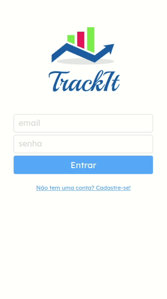
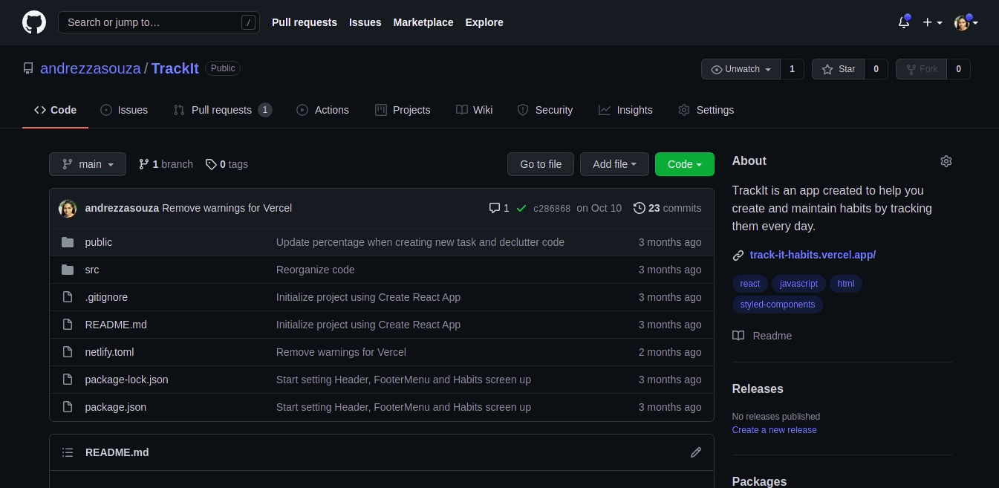

<h1>TrackIt</h1>



TrackIt is an app created to help you create and maintain new habits.

You can start getting your control over your routine back right now! Test it here: https://track-it-habits.vercel.app/

<h2>Contents</h2>

- <a href="#about">About</a>
- <a href="#tech">Technologies</a>
- <a href="#reqs">Requirements</a>
- <a href="#run">How to run</a>

<h2 id="about">About</h2>

TrackIt is a web application that you can use to track your habits.

It allows you to:

- Create an account
- Log into a created account
- Log income and expenses
- Review list of incomes and expenses
- Check out how much money (or debt) you currently have
- Log out to keep your data safe

This app can help you establish a new habit and keep it. Choose how your dream routine would be like and let TrackIt guide you towards it!

<h3>Why?</h3>

TrackIt is my dream app. As a person who has picked up habits only to stop after a while, TrackIt is amazing because it holds you accountable and it motivates you to log in your habits every day.

The great sensation you feel when you check that a habit is completed is wonderful and I believe many people can benefit from an app like that.

<h3> Future Features </h3>
<a href="https://github.com/andrezzasouza/TrackIt/issues/5">

- Implement log out feature
  </a>

<h2 id="tech">Technologies</h2>

- Javascript
- React JS
- React Router DOM
- Axios
- Styled Components
- Husky
- Cypress

<h2 id="reqs">Requirements</h2>

In order to run this project, you must have _npm_ installed.

<h3>Windows</h3>

If you use Microsoft Windows, you can download it from here and run it to install: https://nodejs.org/dist/v16.13.0/node-v16.13.0-x86.msi

<h3>Linux</h3>

However, if you use Linux, you can do so by following the tutorial below.

1. **Open your terminal and run one of these commands.**

Their structure varies according to the distro you are using.

Ubuntu:

```
wget -qO- https://raw.githubusercontent.com/nvm-sh/nvm/v0.38.0/install.sh | bash
```

If the command above does not work, try this one:

```
wget -qO- https://raw.githubusercontent.com/nvm-sh/nvm/v0.38.0/install.sh | bash
```

2. **Close and reopen the terminal before running the following lines:**

```
nvm install --lts
nvm use --lts
```

3. **In case you need extra help:**

You can refer to the official documentation here: https://github.com/nvm-sh/nvm

4. **You are ready to go!**

<h2 id="run">How To Run</h2>

Some steps are necessary for this project to run as it should in your machine.

1. **Clone this repository:**

You can clone this repository by copy this link:



Then you open your terminal and run:

```
git clone https://github.com/andrezzasouza/TrackIt.git
```

2. **Install dependencies:**

Open your prefered terminal and run this command to install the dependencies:

```
  npm i
```

3. **Explore TrackIt:**

In order to run TrackIt and get to explore it, you must run this command on your terminal:

```
  npm start
```
